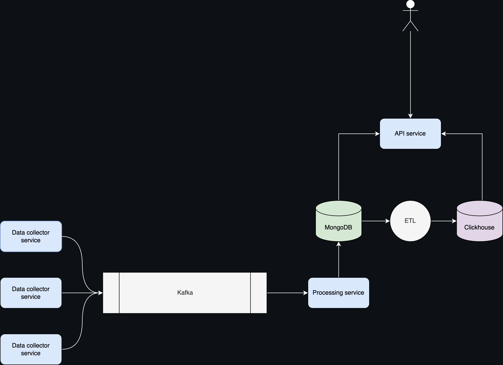

# Flow Wave(Developing)

Flow Wave is a Product Reviews Processing and Analysis Service currently in development. We're working on making it scalable, efficient, and user-friendly.

Service collects product reviews from various platforms, performs sentiment analysis, categorization, and provides aggregated data for analytics and reporting.

## Architecture

The service architecture consists of the following components:

### Data Collectors (Go)

Multiple data collectors in Go have been developed for different platforms. They extract reviews and send them to a message queue Kafka.

### Kafka

Kafka is used for event transmission from data collectors to the main processing service.

### Processing Service (Go)

The main service in Go consumes events from the queue, processes reviews (sentiment analysis, categorization), and stores the results in a database.

### MongoDB

MongoDB is used for storing processed reviews, their categories, and sentiment analysis. MongoDB is suitable for this task as it allows storing structured and semi-structured data.

### ClickHouse

ClickHouse is employed for aggregating and storing analytics data. The ETL service periodically updates aggregated data in ClickHouse based on new reviews from MongoDB.

### API (Go)

A RESTful API in Go has been developed to provide access to analytics data and reports. This API can be used to create a web interface or integrate with other services.

The use of Go and these advanced technologies makes this service scalable, efficient, and powerful. This service is an ideal solution for businesses looking to improve their customer experience, monitor their product reputation, and gain valuable insights from customer feedback.
